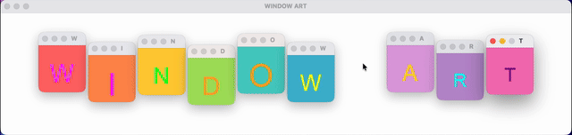

# window-art

A minimal Python library for live coding visual scenes using desktop windows.



Create, animate, and manipulate colored desktop windows with smooth animations and easing functions. Perfect for creative coding, live performances, and visual experiments.

## Features

- **Simple API** - Create windows with a single function call
- **Smooth Animations** - Move, resize, and fade with 24+ easing functions
- **CSS-like Colors** - Use named colors, hex codes, or RGB tuples
- **Grid Layouts** - CSS Grid-inspired layout system
- **Media Support** - Display images, animated GIFs, and videos
- **Cross-Platform** - Works on macOS, Linux, and Windows via SDL2

## Quick Example

```python
import window_art as wa

# Create a window
with wa.run():
    win = wa.window(100, 100, 200, 200, color="coral")

    # Animate it
    wa.move(win, 500, 300, duration=1.0, ease="ease_out_cubic")
    wa.fade(win, 0.5, duration=0.5)

    # Change color
    win.color = "dodgerblue"

    wa.wait(2)
```

## Installation

```bash
pip install window-art
```

## What's Next?

- [Installation](getting-started/installation.md) - Detailed installation instructions
- [Quick Start](getting-started/quickstart.md) - Create your first animated window
- [Basic Concepts](getting-started/concepts.md) - Understand the core architecture
- [Examples](examples.md) - Learn from working examples

## License

MIT License - see [LICENSE](https://github.com/willmeyers/window-art/blob/main/LICENSE) for details.
